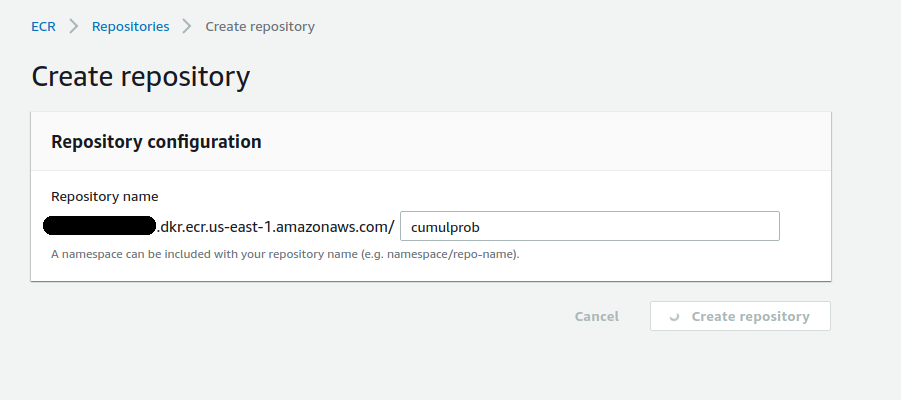

# Deploying Python application using Docker and AWS

The use of Docker in conjunction with AWS can be highly effective when it comes to building a data pipeline.

Let me ask you if you have ever had this situation before. You are building a model in Python which you need to send over to a third-party, e.g. a client, colleague, etc. However, the person on the other end cannot run the code! Maybe they don't have the right libraries installed, or their system is not configured correctly.

Whatever the reason, Docker alleviates this situation by storing the necessary components in an image, which can then be used by a third-party to deploy an application effectively.

In this example, we will see how a simple Python script can be incorporated into a Docker image, and this image will then be pushed to ECR (Elastic Container Registry) in AWS.

## Python Script

Consider a Python script that reads, cleans, transforms, describes and analyses data. This is the basis of a Machine Learning pipeline, however sharing this with a client may result in dependancy clashes and incompatible operating systems. We can run the python script in a docker container to avoid this. 

## Docker Components

A folder is created with the following components:

- Python code (runApp.py)
- Dockerfile
- .sh file (terminal.sh)

Please see the **ML-Pipeline-Docker** folder on the [Github repository](https://github.com/ChristinaLast/ML-Pipeline-Docker) for the full code.

The script **runApp.py** calls the script **dataCleaning.py**, both contain the full Python code that is being executed, while the **Dockerfile** contains the set of instructions used to build the Docker image.

To run the `.sh` file, execute the following command:

```sh terminal.sh```

### Dockerfile

A terminal is opened, Docker is installed, and the image is generated:

```
snap install docker --devmode
docker build -t app .
docker images
docker run --name app -p 5000:5000 app
```

When checking ```docker images```, we see that the image is confirmed to exist:

```
REPOSITORY                           TAG                 IMAGE ID            CREATED             SIZE
app                                  latest              afe3965d6b7b        20 minutes ago 
```

## Pushing to ECR - AWS

So, the application has been created in Docker. However, there are many instance where a Docker image will need to be pushed to a cloud environment. In this instance, here is how the image just created can be pushed to ECR.

Firstly, a repository is created in ECR - I choose to assign the name **docker-aws** to the repository in this instance:



To log into the AWS account through the CLI (command line interface), make sure you have configured your [access and secret access keys]. The following [guide from AWS](https://docs.aws.amazon.com/general/latest/gr/aws-sec-cred-types.html) provides more information on this.

Once that is configured, the Docker image can now be pushed to the ECR.

In the terminal, log into the ECR instance:

```aws ecr get-login --no-include-email --region us-east-1```

In this example, the US-East region is used, but you should use the region that your repository is hosted in. Moreover, you should also make sure that this is the same region as associated with the one specified when configuring your login details - a mismatch can result in the connection failing.

A login link is generated, and this is then prefixed with **sudo** to login. You should see the prompt **"Login successful"**.

The relevant Docker image is tagged, and the repository directory is set:

```docker tag docker-aws:latest youraddress.dkr.ecr.us-east-1.amazonaws.com/cumulprob:latest```

Now, the Docker image is pushed to the repository:

```docker push youraddress.dkr.ecr.us-east-1.amazonaws.com/docker-aws:latest```

Once all the instances display **Pushed**, then the Docker image should now appear in the repository.

Note that a Docker container or image can be removed by inputting the following into a Linux terminal:

**To remove a container:**

```docker rm containerID```

**To remove an image:**

```docker rmi imageID```

**containerID** and **imageID** are replaced with the sequence of letters and numbers that represents the container or image.

## Conclusion

In this example, we have seen how to generate a Docker image for a machine learning application in Python, and then push the Docker image to an AWS ECR repository. Hope you found this useful!
